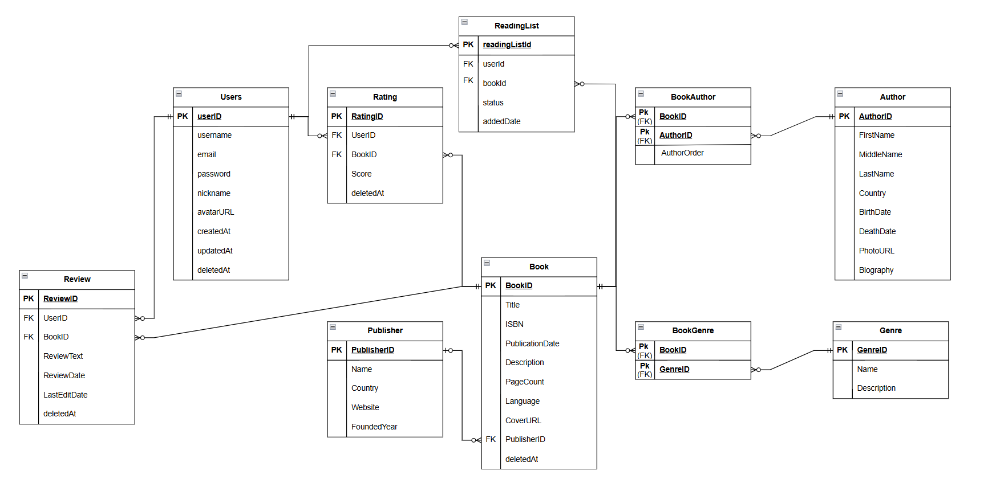

# Документація схеми бази даних Book Rating System

## Зміст

1. [ER-діаграма](#er-діаграма)
2. [Загальний опис](#загальний-опис)
3. [Опис таблиць](#опис-таблиць)
4. [Зв'язки між таблицями](#звязки-між-таблицями)
5. [Індексація](#індексація)

---

## ER-діаграма

## 

## Загальний опис

База даних **Book Rating System** спроектована для зберігання інформації про книги, авторів, видавництва, та взаємодію користувачів з книгами через рейтинги та відгуки.

### Основні характеристики:

- **Нормальна форма:** 3НФ (Третя Нормальна Форма)
- **Кількість таблиць:** 10
- **Типи зв'язків:** 1:N, M:N
- **Підхід до видалення:** Soft Delete (м'яке видалення)
- **СУБД:** PostgreSQL 16

---

## Опис таблиць

### 1. Users (Користувачі)

**Призначення:** Зберігає інформацію про користувачів системи.

| Колонка   | Тип          | Обмеження        | Опис                                 |
| --------- | ------------ | ---------------- | ------------------------------------ |
| userId    | SERIAL       | PRIMARY KEY      | Унікальний ідентифікатор користувача |
| username  | VARCHAR(50)  | UNIQUE, NOT NULL | Ім'я користувача для входу           |
| email     | VARCHAR(100) | UNIQUE, NOT NULL | Електронна пошта                     |
| password  | VARCHAR(255) | NOT NULL         | Хешований пароль                     |
| nickname  | VARCHAR(50)  | NULL             | Відображуване ім'я (псевдонім)       |
| createdAt | TIMESTAMP    | DEFAULT NOW()    | Дата реєстрації                      |
| updatedAt | TIMESTAMP    | AUTO UPDATE      | Дата останнього оновлення            |
| deletedAt | TIMESTAMP    | NULL             | Мітка м'якого видалення              |

**Індекси:**

- `idx_user_email` на `email` - для швидкого пошуку при вході

**CHECK Constraints:**

- `email LIKE '%@%'` - email має містити символ @

**Зв'язки:**

- 1:N з `Rating` (користувач може мати багато оцінок)
- 1:N з `Review` (користувач може мати багато відгуків)
- 1:N з `ReadingList` (користувач може мати багато книг у списку)

---

### 2. Publisher (Видавництво)

**Призначення:** Зберігає інформацію про видавництва книг.

| Колонка     | Тип          | Обмеження   | Опис                                 |
| ----------- | ------------ | ----------- | ------------------------------------ |
| publisherId | SERIAL       | PRIMARY KEY | Унікальний ідентифікатор видавництва |
| name        | VARCHAR(100) | NOT NULL    | Назва видавництва                    |
| country     | VARCHAR(50)  | NULL        | Країна розташування                  |
| website     | TEXT         | NULL        | Веб-сайт видавництва                 |
| foundedYear | INTEGER      | NULL        | Рік заснування                       |

**CHECK Constraints:**

- `foundedYear >= 1450 AND foundedYear <= CURRENT_YEAR` - рік заснування в розумних межах

**Зв'язки:**

- 1:N з `Book` (видавництво може випустити багато книг)

---

### 3. Author (Автор)

**Призначення:** Зберігає інформацію про авторів книг.

| Колонка    | Тип         | Обмеження   | Опис                            |
| ---------- | ----------- | ----------- | ------------------------------- |
| authorId   | SERIAL      | PRIMARY KEY | Унікальний ідентифікатор автора |
| firstName  | VARCHAR(50) | NOT NULL    | Ім'я автора                     |
| middleName | VARCHAR(50) | NULL        | По батькові (опціонально)       |
| lastName   | VARCHAR(50) | NOT NULL    | Прізвище автора                 |
| country    | VARCHAR(50) | NULL        | Країна походження               |
| birthDate  | DATE        | NULL        | Дата народження                 |
| deathDate  | DATE        | NULL        | Дата смерті                     |
| photoUrl   | TEXT        | NULL        | URL фотографії автора           |
| biography  | TEXT        | NULL        | Біографічна інформація          |

**Індекси:**

- `idx_author_lastname` на `lastName` - для пошуку за прізвищем

**CHECK Constraints:**

- `deathDate IS NULL OR deathDate >= birthDate` - дата смерті не може бути раніше дати народження

**Рішення:** Розділення `FullName` на `firstName`, `middleName`, `lastName` для дотримання 1НФ (атомарність даних).

**Зв'язки:**

- M:N з `Book` через `BookAuthor` (автор може написати багато книг, книга може мати багато авторів)

---

### 4. Genre (Жанр)

**Призначення:** Класифікація книг за жанрами.

| Колонка     | Тип         | Обмеження        | Опис                           |
| ----------- | ----------- | ---------------- | ------------------------------ |
| genreId     | SERIAL      | PRIMARY KEY      | Унікальний ідентифікатор жанру |
| name        | VARCHAR(50) | UNIQUE, NOT NULL | Назва жанру                    |
| description | TEXT        | NULL             | Опис жанру                     |

**Зв'язки:**

- M:N з `Book` через `BookGenre` (жанр може мати багато книг, книга може належати до кількох жанрів)

---

### 5. Book (Книга)

**Призначення:** Центральна таблиця з інформацією про книги.

| Колонка         | Тип          | Обмеження         | Опис                                |
| --------------- | ------------ | ----------------- | ----------------------------------- |
| bookId          | SERIAL       | PRIMARY KEY       | Унікальний ідентифікатор книги      |
| title           | VARCHAR(255) | NOT NULL          | Назва книги                         |
| isbn            | VARCHAR(17)  | UNIQUE            | Міжнародний стандартний номер книги |
| publicationDate | DATE         | NULL              | Дата публікації                     |
| description     | TEXT         | NULL              | Опис книги                          |
| pageCount       | INTEGER      | NULL              | Кількість сторінок                  |
| language        | VARCHAR(50)  | DEFAULT 'English' | Мова книги                          |
| coverUrl        | TEXT         | NULL              | URL обкладинки                      |
| publisherId     | INTEGER      | FK (SET NULL)     | Посилання на видавництво            |
| deletedAt       | TIMESTAMP    | NULL              | Мітка м'якого видалення             |

**Індекси:**

- `idx_book_title` на `title` - для пошуку за назвою
- `idx_book_publisher` на `publisherId` - для швидкого JOIN

**CHECK Constraints:**

- `pageCount IS NULL OR pageCount > 0` - кількість сторінок має бути більше 0

**Зв'язки:**

- N:1 з `Publisher` (ON DELETE SET NULL - при видаленні видавництва, книга залишається)
- M:N з `Author` через `BookAuthor`
- M:N з `Genre` через `BookGenre`
- 1:N з `Rating`
- 1:N з `Review`
- 1:N з `ReadingList`

---

### 6. BookAuthor (Зв'язок книг з авторами)

**Призначення:** Junction table для реалізації відношення M:N між книгами та авторами.

| Колонка     | Тип     | Обмеження | Опис                             |
| ----------- | ------- | --------- | -------------------------------- |
| bookId      | INTEGER | PK, FK    | Ідентифікатор книги              |
| authorId    | INTEGER | PK, FK    | Ідентифікатор автора             |
| authorOrder | INTEGER | NOT NULL  | Порядок автора (для співавторів) |

**Складений первинний ключ:** `(bookId, authorId)`

**CHECK Constraints:**

- `authorOrder > 0` - порядок має бути додатнім числом

**Призначення `authorOrder`:**  
Дозволяє визначити порядок авторів для книг з кількома авторами (наприклад: "Перший автор: John Doe, Другий автор: Jane Smith").

**Каскадне видалення:**

- ON DELETE CASCADE - при видаленні книги або автора, зв'язок видаляється автоматично

---

### 7. BookGenre (Зв'язок книг з жанрами)

**Призначення:** Junction table для реалізації відношення M:N між книгами та жанрами.

| Колонка | Тип     | Обмеження | Опис                |
| ------- | ------- | --------- | ------------------- |
| bookId  | INTEGER | PK, FK    | Ідентифікатор книги |
| genreId | INTEGER | PK, FK    | Ідентифікатор жанру |

**Складений первинний ключ:** `(bookId, genreId)`

**Каскадне видалення:**

- ON DELETE CASCADE - при видаленні книги або жанру, зв'язок видаляється

---

### 8. Rating (Оцінка)

**Призначення:** Зберігає числові оцінки книг від користувачів.

| Колонка   | Тип          | Обмеження    | Опис                            |
| --------- | ------------ | ------------ | ------------------------------- |
| ratingId  | SERIAL       | PRIMARY KEY  | Унікальний ідентифікатор оцінки |
| userId    | INTEGER      | FK, NOT NULL | Хто оцінив                      |
| bookId    | INTEGER      | FK, NOT NULL | Яку книгу оцінили               |
| score     | DECIMAL(2,1) | NOT NULL     | Оцінка (1.0-5.0)                |
| updatedAt | TIMESTAMP    | AUTO UPDATE  | Час останнього оновлення оцінки |
| deletedAt | TIMESTAMP    | NULL         | Мітка м'якого видалення         |

**Індекси:**

- `idx_rating_book` на `bookId` - для підрахунку статистики книги

**Унікальний індекс:**

- `UNIQUE(userId, bookId)` - користувач може оцінити книгу лише один раз

**CHECK Constraints:**

- `score >= 1.0 AND score <= 5.0` - оцінка в межах від 1 до 5

**Каскадне видалення:**

- ON DELETE CASCADE - при видаленні користувача або книги, рейтинг видаляється

**Оптимістичне блокування:**  
Поле `updatedAt` використовується для перевірки конфліктів версій при одночасному оновленні.

---

### 9. Review (Відгук)

**Призначення:** Зберігає текстові відгуки користувачів про книги.

| Колонка      | Тип       | Обмеження     | Опис                             |
| ------------ | --------- | ------------- | -------------------------------- |
| reviewId     | SERIAL    | PRIMARY KEY   | Унікальний ідентифікатор відгуку |
| userId       | INTEGER   | FK, NOT NULL  | Автор відгуку                    |
| bookId       | INTEGER   | FK, NOT NULL  | Книга, до якої відгук            |
| reviewText   | TEXT      | NOT NULL      | Текст відгуку                    |
| reviewDate   | TIMESTAMP | DEFAULT NOW() | Дата створення відгуку           |
| lastEditDate | TIMESTAMP | NULL          | Дата останнього редагування      |
| deletedAt    | TIMESTAMP | NULL          | Мітка м'якого видалення          |

**Індекси:**

- `idx_review_book` на `bookId` - для відображення відгуків книги

**Унікальний індекс:**

- `UNIQUE(userId, bookId)` - користувач може написати один відгук на книгу

**CHECK Constraints:**

- `LENGTH(reviewText) >= 10 AND LENGTH(reviewText) <= 5000` - довжина відгуку від 10 до 5000 символів

**Каскадне видалення:**

- ON DELETE CASCADE - при видаленні користувача або книги, відгук видаляється

---

### 10. ReadingList (Список читання)

**Призначення:** Зберігає списки книг користувачів з їх статусом.

| Колонка       | Тип         | Обмеження     | Опис                                       |
| ------------- | ----------- | ------------- | ------------------------------------------ |
| readingListId | SERIAL      | PRIMARY KEY   | Унікальний ідентифікатор запису            |
| userId        | INTEGER     | FK, NOT NULL  | Користувач                                 |
| bookId        | INTEGER     | FK, NOT NULL  | Книга                                      |
| status        | VARCHAR(20) | NOT NULL      | Статус ('to_read', 'reading', 'completed') |
| addedDate     | TIMESTAMP   | DEFAULT NOW() | Дата додавання до списку                   |

**Індекси:**

- `idx_readinglist_user` на `userId` - для відображення списку користувача

**Унікальний індекс:**

- `UNIQUE(userId, bookId)` - книга може бути в списку користувача лише один раз

**Каскадне видалення:**

- ON DELETE CASCADE - при видаленні користувача або книги, запис видаляється

---

## Зв'язки між таблицями

### 1:N (Один-до-багатьох)

| Батьківська таблиця | Дочірня таблиця | Опис                                      |
| ------------------- | --------------- | ----------------------------------------- |
| Users               | Rating          | Один користувач → багато оцінок           |
| Users               | Review          | Один користувач → багато відгуків         |
| Users               | ReadingList     | Один користувач → багато записів у списку |
| Publisher           | Book            | Одне видавництво → багато книг            |
| Book                | Rating          | Одна книга → багато оцінок                |
| Book                | Review          | Одна книга → багато відгуків              |
| Book                | ReadingList     | Одна книга → багато записів у списках     |

### M:N (Багато-до-багатьох)

| Таблиця 1 | Junction Table | Таблиця 2 | Опис                                                              |
| --------- | -------------- | --------- | ----------------------------------------------------------------- |
| Book      | BookAuthor     | Author    | Книга може мати багато авторів; автор може написати багато книг   |
| Book      | BookGenre      | Genre     | Книга може належати до кількох жанрів; жанр може мати багато книг |

---

## Індексація

### Стратегія індексування

**Індекси створені для:**

1. Первинні ключі (автоматично)
2. Зовнішні ключі (для JOIN операцій)
3. Колонки, що часто використовуються у WHERE
4. UNIQUE constraints (автоматично)

### Список індексів

| Таблиця     | Індекс                 | Тип         | Призначення                |
| ----------- | ---------------------- | ----------- | -------------------------- |
| Users       | `users_pkey`           | PRIMARY KEY | Первинний ключ             |
| Users       | `users_username_key`   | UNIQUE      | Унікальність username      |
| Users       | `users_email_key`      | UNIQUE      | Унікальність email         |
| Users       | `idx_user_email`       | INDEX       | Пошук при вході в систему  |
| Author      | `idx_author_lastname`  | INDEX       | Пошук авторів за прізвищем |
| Book        | `idx_book_title`       | INDEX       | Пошук книг за назвою       |
| Book        | `idx_book_publisher`   | INDEX       | JOIN з Publisher           |
| Rating      | `idx_rating_book`      | INDEX       | Статистика по книгах       |
| Review      | `idx_review_book`      | INDEX       | Відгуки по книгах          |
| ReadingList | `idx_readinglist_user` | INDEX       | Список читання користувача |

### Чому не індексували все?

**Принципи:**

- Індекси прискорюють SELECT, але сповільнюють INSERT/UPDATE/DELETE
- Індексуємо колонки з високою кардинальністю (багато унікальних значень)
- Не індексуємо колонки, що рідко використовуються у WHERE
